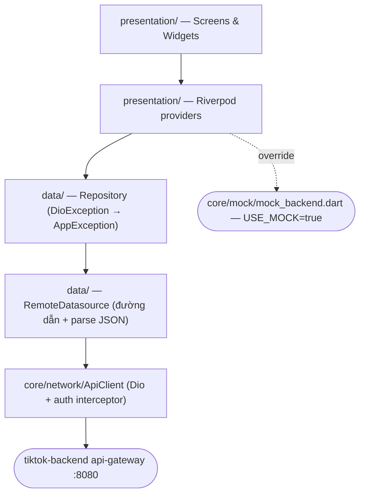

<div align="center">

# 📱 TikTok Mobile

### Flutter App — Dart 3.10 · Riverpod · go_router · Feature-first Architecture


Client cho [tiktok-backend](../tiktok-backend) · 8 feature module · Auth + Feed + Comment + User · Mock backend chạy offline

</div>

---

## 📚 Mục lục

- [Tech Stack](#-tech-stack)
- [Kiến trúc tổng quan](#-kiến-trúc-tổng-quan)
- [Cấu trúc dự án](#-cấu-trúc-dự-án)
- [Bắt đầu nhanh](#-bắt-đầu-nhanh)
- [Cấu hình môi trường](#-cấu-hình-môi-trường)
- [Bản đồ route](#-bản-đồ-route)
- [API backend đang dùng](#-api-backend-đang-dùng)
- [Testing](#-testing)

---

## 🧱 Tech Stack

| Layer          | Technology                                          |
|----------------|-----------------------------------------------------|
| 🎯 Language     | Dart 3.10 (`sdk: ^3.10.7`)                          |
| 💙 Framework    | Flutter (Material 3)                                |
| 🧠 State        | flutter_riverpod 2.6 + riverpod_generator           |
| 🧭 Routing      | go_router 14                                        |
| 🌐 HTTP         | Dio 5 (interceptor tự refresh token)                |
| 🔌 Realtime     | web_socket_channel 3 (hạ tầng, chưa nối feature nào)|
| 🧊 Models       | freezed 2 + json_serializable 6                     |
| 🔐 Storage      | flutter_secure_storage (token) + shared_preferences |
| 🎬 Video        | video_player 2 + cached_network_image               |
| 🔤 Fonts        | google_fonts                                        |
| 🧪 Test         | flutter_test · integration_test · mocktail          |

## 🗺️ Kiến trúc tổng quan



Luật một chiều: `presentation → data → core`. Feature **không** import `presentation/` của feature khác;
`core/` **không bao giờ** import `features/` — đó là lý do `ApiClient` tự gọi `/auth/refresh`
thay vì dùng `AuthRemoteDatasource`.

## 📁 Cấu trúc dự án

```
tiktok_mobile/
├── lib/
│   ├── main.dart                  # Bootstrap: ProviderScope + mockOverrides()
│   ├── core/
│   │   ├── constants/env.dart     # API_BASE_URL, USE_MOCK (dart-define)
│   │   ├── network/               # ApiClient, ApiResponse, PageResponse, AppException,
│   │   │                          # SecureTokenStorage, WebSocketService
│   │   ├── router/app_router.dart # go_router + redirect theo trạng thái đăng nhập
│   │   ├── theme/app_theme.dart   # NowaColors — dark theme của app chính
│   │   ├── mock/mock_backend.dart # Repository giả lập khi không có backend
│   │   ├── utils/                 # time_ago, ...
│   │   └── widgets/               # design_system, nav_bar, action_rail, error_view, ...
│   └── features/
│       ├── auth/                  # Đăng ký, đăng nhập, verify email, reset password
│       ├── feed/                  # For You feed, video player, share sheet
│       ├── comment/               # Comment sheet + phân trang
│       ├── user/                  # Profile, edit profile, follow/block/mute
│       ├── discover/              # Màn khám phá
│       ├── create/                # Màn tạo video
│       ├── inbox/                 # Thông báo
│       └── shell/                 # HomeShell — bottom nav 5 tab
├── test/                          # Unit + widget test, soi gương cây lib/
├── integration_test/              # auth_flow_test.dart — chạy với backend thật
├── android/ ios/ web/ ...         # Platform runners (appId: com.tiktokclone.mobile)
├── analysis_options.yaml
└── pubspec.yaml
```

Mỗi feature theo đúng ba lớp:

```
features/{feature}/
├── data/
│   ├── {feature}_remote_datasource.dart   # HTTP thuần, trả model
│   ├── {feature}_repository.dart          # Bọc lỗi — lớp duy nhất provider được gọi
│   └── {x}_model.dart                     # freezed + json_serializable
└── presentation/
    ├── {feature}_provider.dart            # @riverpod → sinh {feature}_provider.g.dart
    ├── {x}_screen.dart
    └── widgets/
```

## 🚀 Bắt đầu nhanh

### 1. Yêu cầu

- Flutter SDK (channel stable, Dart ≥ 3.10)
- Xcode (iOS) hoặc Android Studio + Android SDK
- Backend chạy sẵn: `cd ../tiktok-backend && make infra-up && make run-gateway` — hoặc bỏ qua, dùng `USE_MOCK=true`

### 2. Cài dependency

```bash
flutter pub get
```

### 3. Sinh code (freezed / json_serializable / riverpod_generator)

```bash
dart run build_runner build --delete-conflicting-outputs
# Vừa sửa model vừa code:
dart run build_runner watch --delete-conflicting-outputs
```

### 4. Chạy app

```bash
# Không cần backend — dữ liệu mẫu trong bộ nhớ
flutter run --dart-define=USE_MOCK=true

# Với backend thật
flutter run --dart-define=API_BASE_URL=http://localhost:8080/api/v1
```

### 5. Kiểm tra trước khi commit

```bash
flutter analyze && flutter test
```

## ⚙️ Cấu hình môi trường

Không có file `.env` — mọi cấu hình truyền qua `--dart-define`, đọc trong `lib/core/constants/env.dart`.

| Biến           | Mặc định                       | Ý nghĩa                                         |
|----------------|--------------------------------|-------------------------------------------------|
| `API_BASE_URL` | `http://localhost:8080/api/v1` | Gốc của api-gateway                             |
| `USE_MOCK`     | `false`                        | `true` → thay repository bằng mock trong bộ nhớ |

| Thiết bị          | `API_BASE_URL` nên dùng           |
|-------------------|-----------------------------------|
| iOS Simulator     | `http://localhost:8080/api/v1`    |
| Android Emulator  | `http://10.0.2.2:8080/api/v1`     |
| Máy thật cùng LAN | `http://<IP-máy-dev>:8080/api/v1` |

## 🧭 Bản đồ route

| Route                                     | Màn hình                                  | Cần đăng nhập |
|-------------------------------------------|-------------------------------------------|---------------|
| `/feed`                                   | `HomeShell` (5 tab)                       | Không — khách xem được |
| `/login`, `/register`                     | Chọn nhà cung cấp (email/Google/Facebook) | Không |
| `/login/email`, `/register/email`         | Form email + mật khẩu                     | Không |
| `/verify-email`                           | Nhập OTP xác minh email                   | Vào được cả khi đã đăng nhập |
| `/forgot-password`, `/reset-password`     | Khôi phục mật khẩu                        | Không |
| `/profile`, `/profile/edit`               | Hồ sơ của tôi                             | Có |
| `/profile/:userId`                        | Hồ sơ người khác                          | Có |
| `/profile/:userId/followers` `/following` | Danh sách người dùng                      | Có |
| `/me/blocked`, `/me/muted`                | Danh sách chặn / tắt tiếng                | Có |

Redirect nằm trong `app_router.dart`: chưa đăng nhập mà vào route ngoài whitelist → `/login`;
đã đăng nhập mà vào route auth → `/feed` (trừ `/verify-email`).

## 🔌 API backend đang dùng

| Nhóm    | Endpoint |
|---------|----------|
| auth    | `POST /auth/register` `/auth/login` `/auth/logout` `/auth/refresh` `/auth/verify-email` `/auth/resend-verification` `/auth/forgot-password` `/auth/reset-password` · `GET /auth/me` |
| user    | `GET/PATCH /users/me` · `GET /users/{id}` · `POST/DELETE /users/{id}/follow` `/block` `/mute` · `GET /users/{id}/followers` `/following` · `GET /users/me/blocked` `/muted` |
| video   | `GET /videos/feed` · `GET /videos/{id}` · `GET /videos/users/{userId}` · `DELETE /videos/{id}` |
| comment | `GET/POST /videos/{videoId}/comments` |

Response luôn là envelope `{ success, data, code, message, timestamp }` (`ApiResponse<T>`);
danh sách trả `PageResponse<T>` (`content`, `page`, `size`, `totalElements`, `last`).

## 🧪 Testing

```bash
flutter test                     # Unit + widget (test/)
flutter test test/features/auth  # Một thư mục
flutter test --coverage          # Sinh coverage/lcov.info

# Integration test — cần simulator/thiết bị VÀ backend thật đang chạy
flutter test integration_test/auth_flow_test.dart \
  --dart-define=API_BASE_URL=http://localhost:8080/api/v1
```

Cây `test/` phản chiếu `lib/`: `lib/features/feed/data/feed_repository.dart` ↔
`test/features/feed/data/feed_repository_test.dart`. Mock viết bằng `mocktail`, không sinh bằng codegen.
